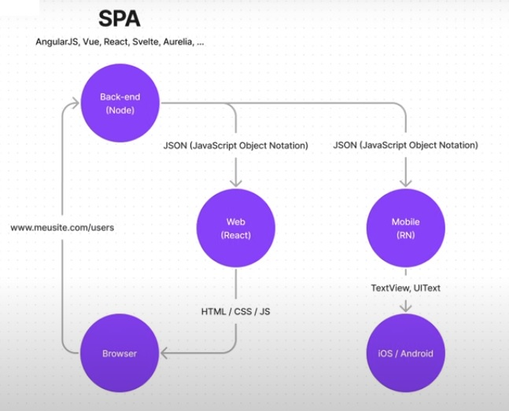

(2020) Hoje quando vamos desenvolver uma aplicação web temos 2 formatos mais comuns SSR (Server Side Rendering) e SPA (single page aplication)

SSR (Server Side Rendering)
Worldpress, Ruby & Rails (github), Magento...(aplicações mais tradicionais)

Na aplicação SSR temos 2 atores
- A aplicação (BackEnd + FrontEnd)
- Browser

1 - O usuário faz uma requisição a aplicação
2 - A aplicação processa a requisição e envia um código (HTML / CSS / JS) para o browser.

Problema :
- Conforme tivemos mais dispositivos que consome a aplicação (mobile android/ mobile IOS, APIs...). Se a aplicação só retorna HTML e CSS o android, o IOS e as APIs não entendem HTML e CSS... Aplicação fica muito restrita a funcionar apenas com o Navegador.

Para contornar isso se faz duplicações para enviar em outros formatos (JSON, GraphQl, SOAP...)

SPA (Single Page Application)

Na aplicação SPA temos 3 atores
- A aplicação BackEnd
- A aplicação FrontEnd
- Browser

1 - O usuário faz uma requisição a aplicação
2 - O backEnd envia para o FrontEnd uma estrutura de dados JSON(Javascript Object Notation), XML...
2 - A aplicação FrontEnd processa a requisição e envia um código de acordo com seus respectivos dispositivos.