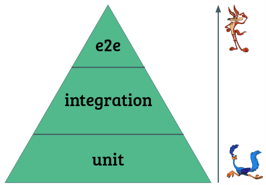

- Você só sabe se alguma coisa funciona quando ela é testada

## 3 diferentes tipos de testes automatizados:

- Teste de unidade: Testa apenas um pedaço do seu código de forma totalmente isolada. Esse pedaço não pode depender de nada (incluindo banco de dados), não pode depender de outra classes, você precis testar apenas e garantir aquele comportamento.

  Limitação do Teste Unitário: 
    
    Só pode testar funções puras (que com os mesmos parâmetros retorne os mesmos resultados)
    
    Só pode testar função que não depende de coisas externas (deve testar coisas desacopladas a servidores, banco de dados...)

- Teste de Integração: Você pode pegar diversas unidades e fazer com que elas se comuniquem ou eventualmente você pode até acessar um banco de dados para fazer algum tipo de teste 

- Teste End to End (E2E): É onde você automatiza o processo de entrada desde a cadeia de início do seu software até o resultado final

(Apesar dos testes de integração e End to End poderem usar coisas externas (banco de dados, apis...). A partir do momento que você cria testes End to End que usa coisas externas ele se torna extremamente custoso).

